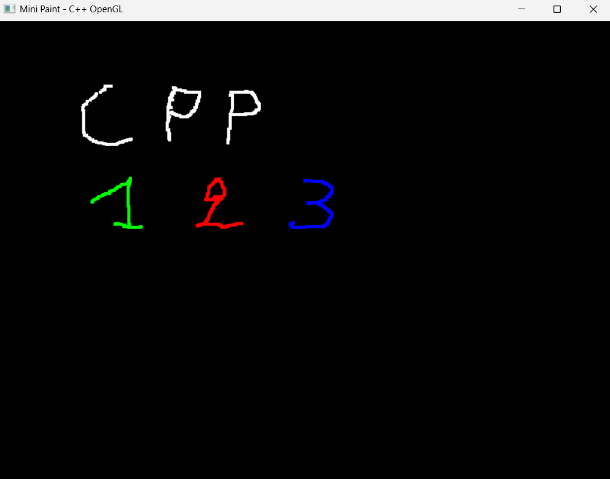

# 🖌️ CppMouseDraw

A simple **C++ OpenGL + FreeGLUT** program that opens a window and lets you **draw with your mouse**.  
Features color switching, eraser, and clear screen.  

---

## 📂 Project Structure

```
CppMouseDraw/
├─ freeglut/ # FreeGLUT library (headers, libs, dlls)
│ ├─ include/GL/glut.h
│ ├─ lib/x64/libfreeglut.a
│ ├─ bin/x64/freeglut.dll
├─ main.cpp # Source code
├─ README.md # Project documentation

```

---

## ⚙️ Requirements
- **MinGW (64-bit)**  
- **FreeGLUT 3.0.0 MinGW Package**  
  👉 Download: [TransmissionZero FreeGLUT](https://www.transmissionzero.co.uk/software/freeglut-devel/)  

---

## 🛠️ Setup & Build

1. Copy the FreeGLUT package into the project folder (`CppMouseDraw/freeglut/`).  

2. Compile with MinGW g++ (64-bit):  
   ```bash
   g++ main.cpp -Ifreeglut/include -Lfreeglut/lib/x64 -lfreeglut -lopengl32 -o DrawApp.exe
   ```
3. Copy the 64-bit DLL into the project folder:
   ```
    freeglut/bin/x64/freeglut.dll  →  CppMouseDraw/freeglut.dll
   ```
4. Run :
   ```
    ./DrawApp.exe
   ```

---

## 🖱️ Controls

- **Right-click** clears the screen  
- Change drawing color with keyboard keys:  
  - `R` → Red  
  - `G` → Green  
  - `B` → Blue  
  - `W` → White  
- `E` key enables **eraser mode** (draw in black, same as background)

---

## 📸 Screenshot (example)



---

## 📜 License

MIT License.
